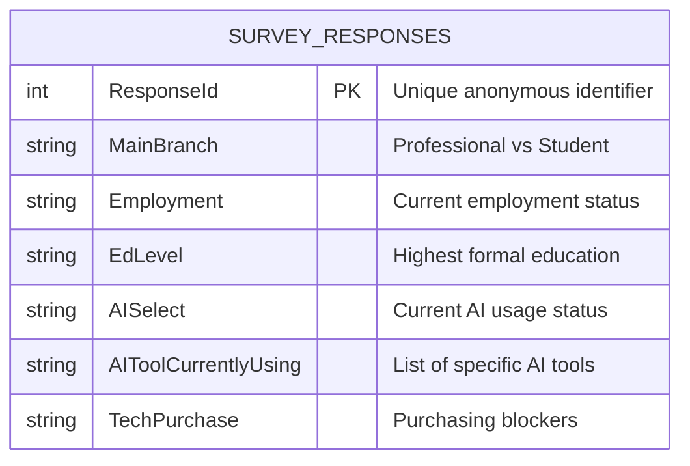

# The AI Divide in Computer Studies Education

## Problem Statement

How does the financial barrier of premium AI coding tools impact the job readiness of Computer Studies students compared to working professionals?

## Audience

This project is for Computer Studies students entering the job market and university curriculum directors who need to understand if paid AI tools are becoming a mandatory barrier to entry.

## KPI or Key Metric

The main metric I want to track is the **Premium AI Adoption Gap** (the difference in usage rates of paid AI tools between students and employed developers).

## Likely Data Source

I will explore the [Stack Overflow Annual Developer Survey 2025 dataset](https://www.kaggle.com/datasets/aliaslam25/stack-overflow-developer-survey-2025). This dataset will be downloaded and used as a **static CSV file**, as the survey results are released annually rather than updated live.

## Possible Final Dashboard

The dashboard should help the audience quickly see the gap in paid AI tool usage between students and professionals, allowing educators to decide if university-sponsored AI subscriptions are necessary to keep students competitive.

## Data Source Notes

### Primary Source

- **Name:** Stack Overflow Developer Survey (2025 Data)
- **URL:** https://www.kaggle.com/datasets/aliaslam25/stack-overflow-developer-survey-2025
- **Format:** CSV
- **Ingestion Strategy:** I will write a Python script (`scripts/ingest.py`) that uses the official `kaggle` Python API library to programmatically authenticate, download, and extract the dataset directly into my local `data/raw/` folder.
- **Coverage:** 49,123 rows × 170 columns covering global tech tool usage.
- **Why it fits the problem:** We will filter the `MainBranch` column to isolate students and cross-reference this with the `AIToolCurrentlyUsing` column to track adoption of premium tools. We will also analyze the `TechPurchase` metrics to see how often "Prohibitive pricing" is cited as a blocker.
- **Known limitations:** Data is self-reported. We must infer financial barriers from employment status and pricing sentiment.

### Fallback Source

- **Name:** GitHub Innovation Graph – Developer Metrics
- **URL:** https://github.com/github/innovationgraph
- **Format:** CSV / API
- **Ingestion Strategy:** I will use a Python script utilizing the `requests` library to fetch the quarterly metrics via the GitHub REST API or programmatically download the raw CSVs into the `data/raw/` folder.
- **Coverage:** Official quarterly metrics on developer activity, push events, and repository data spanning multiple economies.
- **Why it could still work:** If the primary data fails, this official repository from GitHub provides concrete, non-Kaggle data on developer activity that we can use as a proxy for engagement and tool adoption.
- **Known limitations:** Aggregated by economy/region rather than granular, individual student vs. professional survey responses.

---

## Data Ingestion Instructions

Follow these steps to reproduce the automated data extraction from the Kaggle API.

### Prerequisites

1. **Python 3.8+** must be installed on your system.
2. **Kaggle API credentials:** Create a token from your Kaggle account under **Account → API → Create New API Token**. This downloads a `kaggle.json` file containing your username and key. Save it to `~/.kaggle/kaggle.json` (`C:\Users\<you>\.kaggle\kaggle.json` on Windows), or set the `KAGGLE_USERNAME` and `KAGGLE_KEY` environment variables instead.

### Step-by-Step Execution

**1. Install dependencies**

Open your terminal at the root of the project repository and install the required Python libraries using the `requirements.txt` file:

```bash
pip install -r requirements.txt
```

**2. Run the ingestion script**

Execute the Python script located in the `scripts` folder:

```bash
python scripts/ingest.py
```

**3. Expected output**

The data will land in the `data/raw/` folder with a filename that names the source and pull date. If successful, the script will create two files:

- `stack-overflow-2025-raw_<YYYY-MM-DD>.zip` — the untouched, raw dataset downloaded directly from Kaggle.
- `ingestion_log.txt` — a log file recording the exact timestamp and source URL of the download.

## Data Dictionary & ERD

Because this extraction pulls a single flattened CSV file, the architecture relies on one main entity. Below is the Entity Relationship Diagram (ERD) defining the schema for the relevant fields used in our pipeline, followed by the detailed data dictionary.

### Entity Relationship Diagram (ERD)



### Data Dictionary

| Field                  | Unit        | Type    | Description                                                                                                                                  |
| ---------------------- | ----------- | ------- | -------------------------------------------------------------------------------------------------------------------------------------------- |
| `ResponseId`           | Unitless    | INTEGER | Primary key. The unique anonymous identifier assigned to each survey respondent.                                                             |
| `MainBranch`           | Categorical | STRING  | Identifies whether the respondent is a professional developer, a student/learner, or coding as a hobby.                                      |
| `Employment`           | Categorical | STRING  | Current employment status (e.g., Employed full-time, Student).                                                                               |
| `EdLevel`              | Categorical | STRING  | The highest level of formal education the respondent has completed.                                                                          |
| `AISelect`             | Categorical | STRING  | Indicates whether the respondent currently uses AI tools in their development process (Yes/No/Plan to).                                      |
| `AIToolCurrentlyUsing` | List        | STRING  | Semicolon-separated list of the specific AI developer tools the respondent currently uses (e.g., GitHub Copilot; ChatGPT; Claude).           |
| `TechPurchase`         | Categorical | STRING  | Metrics detailing organizational or personal tech purchasing decisions. Used to analyze how often pricing is cited as a prohibitive blocker. |
