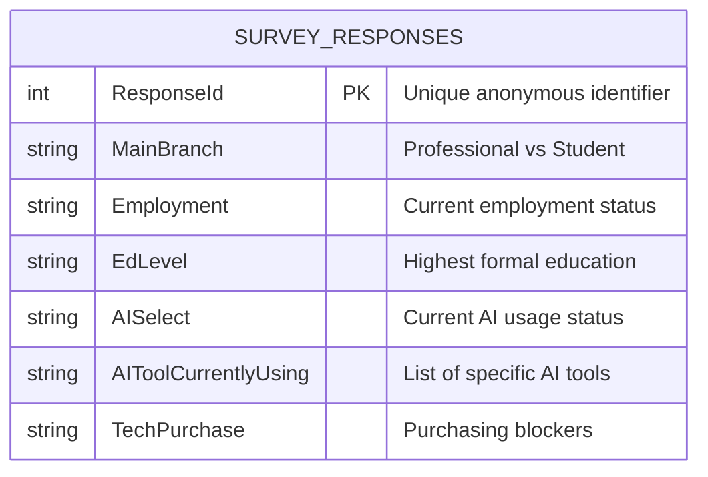

# Data Dictionary & ERD

Schema reference for the raw Stack Overflow Developer Survey data ingested by `scripts/ingest.py` and landed in this folder (`data/raw/`). Because the extraction pulls a single flattened CSV file, the architecture relies on one main entity — the ERD below covers the fields used in the pipeline, followed by the detailed data dictionary.

## Entity Relationship Diagram (ERD)

## Data Dictionary

| Field                  | Unit        | Type    | Description                                                                                                                                  |
| ---------------------- | ----------- | ------- | -------------------------------------------------------------------------------------------------------------------------------------------- |
| `ResponseId`           | Unitless    | INTEGER | Primary key. The unique anonymous identifier assigned to each survey respondent.                                                             |
| `MainBranch`           | Categorical | STRING  | Identifies whether the respondent is a professional developer, a student/learner, or coding as a hobby.                                      |
| `Employment`           | Categorical | STRING  | Current employment status (e.g., Employed full-time, Student).                                                                               |
| `EdLevel`              | Categorical | STRING  | The highest level of formal education the respondent has completed.                                                                          |
| `AISelect`             | Categorical | STRING  | Indicates whether the respondent currently uses AI tools in their development process (Yes/No/Plan to).                                      |
| `AIToolCurrentlyUsing` | List        | STRING  | Semicolon-separated list of the specific AI developer tools the respondent currently uses (e.g., GitHub Copilot; ChatGPT; Claude).           |
| `TechPurchase`         | Categorical | STRING  | Metrics detailing organizational or personal tech purchasing decisions. Used to analyze how often pricing is cited as a prohibitive blocker. |
